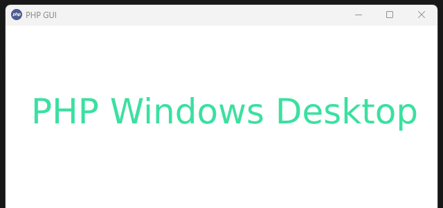

PHP 桌面应用开发
===============

[](http://www.php.net/)
[](https://www.php.net/manual/zh/class.ffi)
[](https://packagist.org/packages/kingbes/framework)

## 要求

* PHP `8.1+`
* FFI `*`

# 安装

```shell
composer create-project kingbes/framework desktop
```

## 启动应用

```shell
cd desktop
php index.php
```

# 命名规范

遵循PSR-2命名规范和PSR-4自动加载规范。

# 文档

