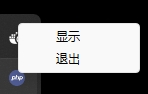

PHP 桌面应用开发
===============

[](http://www.php.net/)
[](https://www.php.net/manual/zh/class.ffi)
[](https://packagist.org/packages/kingbes/framework)

## 要求

* PHP `8.1+`
* FFI `*`

# 安装

```shell
composer create-project kingbes/framework desktop
```

## 启动应用

```shell
cd desktop
php index.php
```

# 命名规范

遵循PSR-2命名规范和PSR-4自动加载规范。

# 文档

## 基础

### 目录结果

```
├─app                应用目录 
│  ├─config          配置目录
│  │  ├─app.php           应用配置
│  │  ├─database.php      数据库配置
│  │  ├─menu.php          图标菜单配置
│  │  └─middleware.php    中间件配置
│  │
│  ├─controller      控制器目录
│  ├─kingbes         源码目录
│  ├─middleware      中间件目录
│  ├─ ...            更多类库目录
│  │
│  ├─public.php      公共函数文件
│  └─sqlite3.db      sqlite文件
│
├─vendor             Composer类库目录
├─view               视图目录
├─composer.json      composer 定义文件
├─favicon.ico        图标文件
├─index.php          入口文件
└─README.md          README 文件
```

### 配置

#### app.php 应用配置

```php
return [
    // 窗口
    "windows" => [
        // 标题
        "title" => "PHP GUI",
        // 宽
        "width" => 640,
        // 高
        "height" => 480,
        // 是否测试模式 ,非测试模式：false
        "debug" => true
    ],
    // 默认控制器
    "default_controller" => "Home",
    // 默认时区
    "default_timezone" => "Asia/Shanghai",
    // 视图
    "default_view" => [
        // 目录名
        "dirname" => "view",
        // 文件后缀
        "suffix" => "html"
    ]
];
```

#### database.php 采用独立的`ThinkORM`库 数据库配置

```php
return [
    'default' => 'sqlite',
    'connections' => [
        'sqlite' => [
            // 数据库类型
            'type'        => 'sqlite',
            // 数据库名
            'database'    => app_path("sqlite3.db"),
            // 数据库编码默认采用utf8
            'charset'     => 'utf8',
            // 数据库表前缀
            'prefix'      => '',
        ],
    ],
];
```

#### menu.php 小图标菜单配置

```php
return [
    [
        "name" => "显示", // 名称
        "fn" => function () { // 点击后触发的函数
            app()->show_win(); // 触发显示窗口函数
        }
    ],
    [
        "name" => "退出",
        "fn" => function () {
            app()->destroy_win(); // 关闭应用
        }
    ]
    ... //追加更多
];
```

效果



#### middleware.php 中间件配置

```php
return [
    // 例子
    app\middleware\TestMiddleware::class
];
```

## 控制器和视图

一个控制器文件对应一个视图文件，控制器 `Home.php` 对应视图 `Home.html`，文件名相同。

### 公共函数

`Home.php` 控制器，每个公共函数绑定一个js函数，可直接在js中触发

```php
namespace app\controller;

class Home
{
    /**
     * get function
     *
     * @param integer $seq 触发次数
     * @param array $req js传来的参数
     * @return array
     */
    public function get(int $seq, array $req): array
    {
        /**
         * 你的逻辑代码 
         */
        ...

        return ["PHP WINDOWS GUI"];
    }
}
```

`Home.html` 视图触发

```html
<!DOCTYPE html>
<html lang="zh-cn">

<head>
    <meta charset="UTF-8">
    <meta name="viewport" content="width=device-width, initial-scale=1.0">
    <title>Document</title>
    <!-- 加载资源文件 -->
    <link rel="stylesheet" href="./public/css/app.css">
</head>

<body>
    <button onclick="onBtn()">触发get</button>
    <script>
        function onBtn(){
            // 直接在js中调用
            get('hello').then(function (res) {
                console.log(res) //拿到的结果
            })
        }
        
    </script>
</body>

</html>
```

### 公共参数

`$width`、`$height`、`$hint` 会改变当前窗口大小

```php
namespace app\controller;

// 窗口提示类型
use app\kingbes\PhpWebview\WindowSizeHint;

class SizeWin
{
    /**
     * 改变当前窗口的宽度 variable
     *
     * @var integer
     */
    public int $width = 800;
    /**
     * 改变当前窗口的高度 variable
     *
     * @var integer
     */
    public int $height = 800;
    /**
     * 改变当前窗口的提示 variable
     *
     * @var WindowSizeHint
     */
    public WindowSizeHint $hint =  WindowSizeHint::HINT_FIXED;
}
```

### 页面跳转

常规的页面跳转是无法绑定到控制器里面的函数的,在js中调用函数`app_jump("要跳转的控制器文件名即可")`

`<button onclick="app_jump('About')">跳转about</button>` 成功跳转到About页面 和绑定好的控制器函数

`<a href="About.html">跳转about</a>` 跳转了，但没有绑定对于的控制器函数 


## 中间件

```php
class TestMiddleware
{
    public function process(string $page, object $next_class): bool
    {
        var_dump("下一页的页面");
        var_dump($page);
        var_dump("下一页的class");
        var_dump($next_class);
        // true 会放行 , false不放行
        return true;
    }
}
```

## 数据库

thinkphp的orm库 [点击进入](https://github.com/top-think/think-orm)

## 自带的公共函数

```php

/**
 * 根目录路径 function
 *
 * @param string ...$path 拼接
 * @return string
 */
function base_path(string ...$path): string {}

/**
 * app目录路径 function
 *
 * @param string ...$path 拼接
 * @return string
 */
function app_path(string ...$path): string {}

/**
 * app应用 function
 *
 * @return object
 */
function app(): object {}

/**
 * 页面跳转 function
 *
 * @param string $page
 * @return void
 */
function app_jump(string $page): void {}

/**
 * 消息对话框 function
 *
 * @param string $str
 * @param integer $type
 * @return boolean
 */
function dialog_msg(string $str, int $type = 0): bool {}

/**
 * 输入对话框 function
 *
 * @return string
 */
function dialog_prompt(): string {}

/**
 * 打开文件对话框 function
 *
 * @return string
 */
function dialog_file(): string {}

/**
 * 打开文件夹对话框 function
 *
 * @param string $default_dir 默认文件夹路径位置
 * @return string
 */
function dialog_dir(string $default_dir = ""): string {}

/**
 * 保存文件对话框 function
 *
 * @param string $content 内容
 * @param string $filename 文件名 如：test.txt
 * @param string $path 保存路径 如：D:/dir
 * @return boolean
 */
function dialog_file(
    string $content,
    string $filename,
    string $path = ""
): bool {}

```